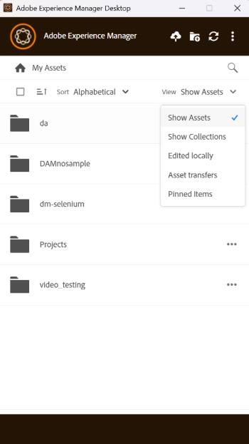

# [!DNL AEM Desktop App]中的Assets管理任务 {#assets-management-tasks}

资产管理涉及组织、维护和优化数字资产以简化工作流。 它包括一些任务，如复制和重命名文件、固定或取消固定文件夹以进行快速访问，以及在各种布局中查看资源。 这有助于提高效率、简化资产跟踪，并确保跨平台轻松检索和组织数字资产。

## 查看资产 {#view-assets}

AEM桌面应用程序允许您以四种不同的视图查看资源：

* **[!UICONTROL Show Assets]：**&#x200B;允许您查看所有资源。
* **[!UICONTROL Show Collections]：**&#x200B;允许您查看在本机AEM应用程序中创建的所有集合。 查看更多[收藏集](#collections-desktop-app)。
* **[!UICONTROL Edited Locally]：**&#x200B;允许您显示所有本地修改的资源。 在此视图中，您可以添加和上传多个资源。
* **[!UICONTROL Asset transfers]：**&#x200B;允许您查看从本地应用程序传输到本地或反向传输的所有资源。
* **[!UICONTROL Pinned items]：**&#x200B;允许您查看所有固定项目。

要在AEM桌面应用程序中的各种资源视图中进行选择，请执行以下步骤：

1. 打开AEM桌面应用程序。

1. 转到右上方的下拉菜单。 从可用视图中选择一个。

   

## 查看新添加的文件夹和文件 {#view-newly-added-files-folders}

您可以将本地计算机上新创建的资源上传到AEM，其中存储了中央存储库。 要在本地查看这些新创建的资产，请转到&#x200B;**[!UICONTROL View]**&#x200B;下拉菜单并选择&#x200B;**[!UICONTROL Show Assets]**&#x200B;以查看所有更新及其时间轴和标题，或选择&#x200B;**[!UICONTROL Edited Locally]**。 这两个选项都会明确显示本地编辑的资源。

## 重复文件 {#duplicate-files}

如果要保留原始文件并对类似文件进行更改，则可以同时复制位于不同位置（本地和云）的文件。 它可以通过跨资产执行重复文件操作来完成。

要在AEM桌面应用程序中复制文件，请执行以下步骤：

1. 浏览到文件夹并选择要复制的资产。

   

1. 单击&#x200B;**[!UICONTROL More actions]** 并选择 **[!UICONTROL Duplicate File]**&#x200B;操作。

1. 将使用相同的文件名和内容创建重复的文件。

## 重命名资源或文件夹的标题 {#rename-asset-title}

要重命名资源或文件夹的标题，请执行以下步骤：

1. 浏览要重命名的资源。 在命名文件夹时，不允许使用特殊字符，如`\ / : * ?  | < > [ ] %`；。 如果包含，它们将自动替换为连字符`-`。

1. 单击&#x200B;**[!UICONTROL More actions]** ，然后选择&#x200B;**[!UICONTROL Rename]**&#x200B;以添加所需的资产标题。

## 固定或取消固定文件夹 {#pin-unpin-folder}

固定文件夹会自动同步，以反映在应用程序内本机所做的任何更改。 要快速访问，您可以通过执行以下步骤来固定或取消固定文件夹：

1. 浏览要固定或取消固定的资源。

1. 单击&#x200B;**[!UICONTROL More actions]** 并选择[!UICONTROL pin]以固定资源或文件夹。 或者，单击[!UICONTROL unpin]以取消固定它。

   

## 自动刷新 {#auto-refresh}

自动刷新功能可自动实时更新内容，确保您始终能够看到最新信息，而无需手动重新加载页面。 执行以下步骤可自动刷新资源以获取已更新资源的列表：

1. 打开AEM桌面应用程序。

1. 单击菜单栏上的以获取更新。

## 收藏集 {#collections-desktop-app}

AEM桌面应用允许您[查看](#view-collections-desktop-app)、[下载](#download-collections-desktop-app)并浏览在[!DNL Adobe Experience Manager Assets]应用程序上创建的集合。

### 查看收藏集 {#view-collections-desktop-app}

执行以下步骤以在桌面应用程序中查看收藏集：

1. 打开AEM桌面应用程序，然后转到[查看资源](#view-assets)。

1. 选择&#x200B;**[!UICONTROL Show Collections]**。 将显示本机应用程序上可用的收藏集。

   

### 下载收藏集 {#download-collections-desktop-app}

执行以下步骤以在桌面应用程序中下载收藏集：

1. 请按照[查看收藏集](#view-collections-desktop-app)中所示的步骤1和2操作。

1. 在要下载的收藏集中转到更多操作。

1. 单击&#x200B;**[!UICONTROL Download]**&#x200B;下载特定收藏集。

## 使用元数据架构创建文件夹 {#create-folder-with-metadata-schema}

使用AEM桌面应用程序，您可以在创建新文件夹时分配元数据。 为此，请执行以下步骤：

1. 转到创建目录图标。 出现&#x200B;**[!UICONTROL Create Directory]**&#x200B;屏幕。

1. 添加以下详细信息：
   * 文件夹的&#x200B;**[!UICONTROL Name]**。
   * **[!UICONTROL Folder Metadata Schema]**&#x200B;以选择文件夹的元数据层次结构，如果您不想将任何元数据与其关联，请选择&#x200B;**[!UICONTROL none]**。

1. 单击&#x200B;**[!UICONTROL OK]**&#x200B;以继续。

## 已转移的资产列表 {#list-of-transferred-assets}

要查看在给定会话中转移的资产列表，请参阅[将资产上传到 [!DNL Experience Manager]](#upload-and-add-new-assets-to-aem)。

## 高级工作流：对相同的文件进行协作并避免编辑冲突 {#adv-workflow-collaborate-avoid-conflicts}

在协作环境中，多个用户可能处理一组相同的资产，这可能会导致版本冲突。 要防止冲突，请遵循以下最佳实践：

* 不要通过单击[!UICONTROL Open]编辑任何资源。 不要通过从文件系统文件夹打开来编辑本地下载的资源。 其他用户不知道该资产正在编辑中。
* 要编辑资源，请始终单击[!UICONTROL Edit]。 它将在本机应用程序中打开资产，并在资产上添加一个锁定图标，以便其他用户知道资产正在编辑中。
* 如果您不小心开始编辑而未单击[!UICONTROL Toggle Check-in]，请单击[!UICONTROL Edit]。 此功能为资源添加一个锁图标。 即使您计划稍后编辑资产但希望避免其他人编辑它，请单击[!UICONTROL Toggle Check-in]以锁定该资产。
* 在编辑资源之前，请确保其他用户未编辑该资源。 在资源上查找锁图标。
* 完成编辑后，上传所有更改，然后签入资产。

如果在[!DNL Experience Manager]服务器上更新了本地下载的资产，则应用会显示&#x200B;**[!UICONTROL Modified remotely]**&#x200B;状态。 通过分别单击[!UICONTROL Remove]或[!UICONTROL Update]，您可以删除本地副本或刷新本地副本。 通过对话框中的链接，可以查看资产的两个版本。

如果您正在本地编辑的资产也在您不知情的情况下在服务器上更新，则应用程序会显示&#x200B;**[!UICONTROL Editing Conflict]**&#x200B;状态。 您可以保留一组更改 — 保留您的更新（单击&#x200B;**[!UICONTROL Keep Mine]**）并删除其他用户的编辑，或遵循其他用户的更新并删除您的更新(**[!UICONTROL Overwrite Mine]**)。

## 高级工作流程：在InDesign文件中放置和链接资源 {#adv-workflow-place-assets-indesign}

当您使用[!DNL Experience Manager]桌面应用程序打开包含链接资源的文件时，这些资源会预先下载并显示在本机应用程序中。 要使此工作流正常工作，您的本机应用程序必须支持放置指向本地资产的链接，并且[!DNL Experience Manager]必须支持在二进制文件中将这些链接解析为服务器端引用。

[!DNL Experience Manager]桌面应用程序通过一些选定的Adobe Creative Cloud桌面应用程序和文件格式(Adobe InDesign、Adobe Illustrator和Adobe Photoshop)支持此工作流。 利用工作流，可高效地使用支持的Creative Cloud文件。 如果用户A将资源添加到InDesign文件并将其签入[!DNL Experience Manager]，则用户B可以在文件中查看资源，即使它们不属于该文件。 这些资产将在用户B的计算机上本地下载。

>[!NOTE]
>
>该桌面应用程序可以映射到Windows上的任何驱动器。 但是，为了顺利操作，请勿更改默认驱动器号。 如果同一组织的用户使用不同的驱动器号，则他们看不到其他用户放置的资产。 路径更改时，不会获取所放置的资产。 置入的资产将继续置于二进制文件（如INDD）中，并且不会被删除。

要了解此工作流的限制，请参阅[系统要求和支持的版本](release-notes.md)。

要使用图像资源和InDesign尝试此工作流，请执行以下步骤：

1. 将已放置资源的INDD文件保存在[!DNL Experience Manager]中。 要了解如何创建此类INDD文件，请参阅[放置图形](https://helpx.adobe.com/indesign/using/placing-graphics.html)。
1. 从桌面应用程序中，**[!UICONTROL Edit]**&#x200B;包含置入了[!DNL Experience Manager]中的资产的INDD文件。
1. 应用程序下载InDesign文件和链接的资源。 InDesign打开文档时，将解析链接，下载资源，并在InDesign文档中显示资源。
1. 要在InDesign文件中放置新图形，请对资源使用&#x200B;**[!UICONTROL Reveal File]**&#x200B;操作。 该操作将在本地下载资产，并在Windows资源管理器或Mac Finder中打开本地网络共享位置。
1. 将显示的资源放入InDesign文档中。 这样做会在文档中创建链接。
1. 在InDesign文档中完成编辑后，保存该文档并使用桌面应用程序将其上传到[!DNL Experience Manager]。

## 后续步骤 {#next-steps}

* [观看视频，开始使用Adobe Experience Manager桌面应用程序](https://experienceleague.adobe.com/en/docs/experience-manager-learn/assets/creative-workflows/aem-desktop-app)

* 通过右侧边栏中的[!UICONTROL Edit this page] 或[!UICONTROL Log an issue] 提供文档反馈

* 联系[客户关怀团队](https://experienceleague.adobe.com/?support-solution=General#support)

<!--* Provide product feedback using the [!UICONTROL Feedback] option available on the AEM Desktop App user interface>-->

>[!MORELIKETHIS]
>
>* [了解用户界面](/help/using/user-interface.md)。
>* [入门指南](/help/using/get-started.md)。
