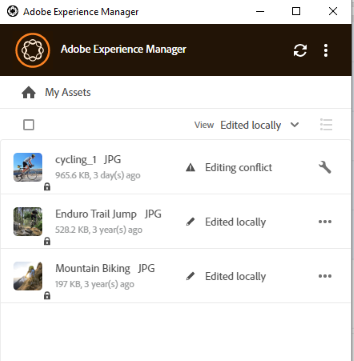

# 浏览、搜索和预览资源 {#browse-search-preview-assets}

您可以在[!DNL Experience Manager]存储库中浏览到、搜索和预览可用资源，所有这些操作都来自桌面应用程序。 在应用程序中尝试以下操作：

1. 浏览到文件夹并查看文件夹中可用资源的一些基本信息，以及所有资源的小型缩略图。

   

1. 要查看单个资产的更多信息和更大的缩略图，请单击文件名。

   

1. 单击&#x200B;**[!UICONTROL Open]**&#x200B;或&#x200B;**[!UICONTROL Edit]**&#x200B;可本地下载文件，并分别在本地应用程序中查看或编辑该文件。
1. 使用关键字搜索以在[!DNL Experience Manager]存储库中查找相关资源。 使用`?`和`*`作为通配符。 这些通配符分别替换单个字符或多个字符。 根据需要筛选和排序结果。

   

   

>[!NOTE]
>
>应用程序通过跨多个元数据字段匹配搜索条件来显示资源，而不只是资源的标题或文件名。

## 在桌面上打开资产 {#openondesktop-v2}

您可以打开远程资产，以便在本机应用程序中查看。 资源将下载到本地文件夹。 然后，它们将在与文件格式关联的本机应用程序中启动。 您可以更改本机应用程序，以在Mac或Windows中打开特定的文件类型（扩展名）。

从资源菜单中单击&#x200B;**[!UICONTROL Open]**。 资产将下载到本地，并在本地应用程序中打开。 在状态栏中检查大型资产的下载进度和传输速度。

<!-- 
-->

>[!NOTE]
>
>如果应用程序未反映预期的更改，请单击刷新图标，或者右键单击应用程序界面并单击&#x200B;**[!UICONTROL Refresh]**。 在大型下载或上传正在进行时，操作不可用。

要打开资源的本地下载文件夹，请单击，然后单击 **[!UICONTROL Reveal File]**&#x200B;操作。

## 使用资产或将资产放入本机文档 {#place-assets-in-native-documents}

在某些情况下，例如在将资源放入本机文档时，您可以在Windows资源管理器或Mac Finder中访问文件。 要访问本地下载文件的文件系统位置，请使用 **[!UICONTROL Reveal File]**&#x200B;选项。

单击文件夹上的&#x200B;**[!UICONTROL Reveal File]**&#x200B;或&#x200B;**[!UICONTROL Reveal Folder]**，以使用本地计算机上预先选定的文件或文件夹打开Windows资源管理器或Mac Finder。 例如，在支持放置或链接本地文件的本地应用程序中放置[!DNL Experience Manager]文件时，选项非常有用。 若要了解如何在Adobe InDesign中放置文件，请参阅[放置图形](https://helpx.adobe.com/cn/indesign/using/placing-graphics.html)。

**[!UICONTROL Reveal File]**&#x200B;操作将打开本地网络共享。 它仅显示本地可用的资源。 也就是说，它会显示使用应用程序显示、下载或打开/编辑的资产。 本地网络共享没有将任何更改上传到[!DNL Experience Manager]。 要上载更改，请在应用程序中显式使用&#x200B;**[!UICONTROL Upload Changes]**&#x200B;或&#x200B;**[!UICONTROL Upload]**&#x200B;操作。

>[!NOTE]
>
>为了与[!DNL Experience Manager]桌面应用程序v1.x向后兼容，显示的文件是从本地网络共享提供的，仅公开本地可用文件。 显示文件的桌面路径与应用程序v1.x创建的路径相同。

>[!CAUTION]
>
>请勿使用&#x200B;**[!UICONTROL Reveal File]**&#x200B;选项编辑本机应用程序中的资产。 请改用&#x200B;**[!UICONTROL Edit]**&#x200B;操作。 要了解更多信息，请参阅[高级工作流：对相同的文件进行协作并避免编辑冲突](#adv-workflow-collaborate-avoid-conflicts)。

### 管理资源名称中的特殊字符 {#special-characters-in-filename}

在旧版应用程序中，在存储库中创建的节点名称会保留用户提供的文件夹名称的空格和大小写。 若要让当前应用程序模拟v1.10应用程序的节点命名规则，请在[!UICONTROL Use legacy conventions when creating nodes for assets and folders]中启用[!UICONTROL Preferences]。 查看[应用程序首选项](/help/using/install-upgrade.md#set-preferences)。 默认情况下，此旧版首选项处于禁用状态。

>[!NOTE]
>
>应用程序使用以下命名惯例仅更改存储库中的节点名称。 应用程序保留资产的`Title`不变。

| 字符‡ | 应用程序中的旧版偏好设置 | 当出现在文件名中时 | 当出现在文件夹名称中时 | 示例 |
|---|---|---|---|---|
| `. / : [ ] \| *` | 启用或禁用 | 已替换为`-`（连字符）。 文件扩展名中的`.` （点）将按原样保留。 | 已替换为`-`（连字符）。 | `myimage.jpg`保持原样，`my.image.jpg`更改为`my-image.jpg`。 |
| `% ; # , + ? ^ { } "`和空格 | 已禁用 | 保留空格 | 已替换为`-`（连字符）。 | `My Folder.`更改到`my-folder-`。 |
| `# % { } ? & .` | 已禁用 | 已替换为`-`（连字符）。 | 不用。 | `#My New File.`更改到`-My New File-`。 |
| 大写字符 | 已禁用 | 外壳保持原样。 | 更改为小写字符。 | `My New Folder`更改到`my-new-folder`。 |
| 大写字符 | 已启用 | 外壳保持原样。 | 外壳保持原样。 | 不用。 |

‡字符列表是以空格分隔的列表。

## 查找所有已编辑的图像 {#find-all-edited-images}

该应用程序提供了一个名为&#x200B;**[!UICONTROL Edited locally]**&#x200B;的视图，通过该视图，您可以快速访问本地下载的所有文件（通过[!UICONTROL Open]或[!UICONTROL Edit]操作），然后对其进行修改。 该应用程序允许您选择所有本地编辑的资产并单击几下以上传更改。 此视图还会显示存在编辑冲突的本地编辑的资源。

## 后续步骤 {#next-steps}

* [观看视频，开始使用Adobe Experience Manager桌面应用程序](https://experienceleague.adobe.com/zh-hans/docs/experience-manager-learn/assets/creative-workflows/aem-desktop-app)

* 通过右侧边栏中的[!UICONTROL Edit this page] 或[!UICONTROL Log an issue] 提供文档反馈

* 联系[客户关怀团队](https://experienceleague.adobe.com/zh-hans?support-solution=General#support)

>[!MORELIKETHIS]
>
>* [了解用户界面](/help/using/user-interface.md)
>* [使用桌面应用程序](/help/using/using-desktop-app.md)
>* [在桌面应用程序中管理Assets](/help/using/assets-management-tasks.md)
