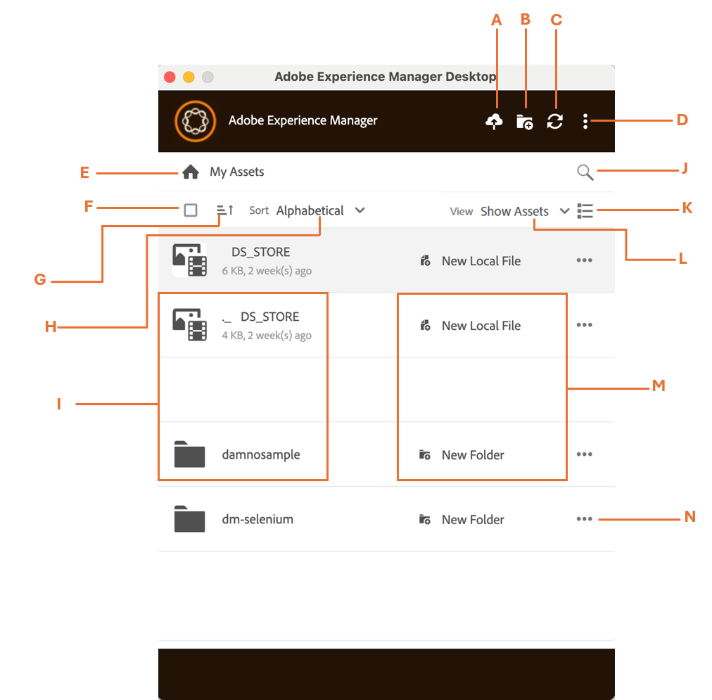

# [!DNL Adobe Experience Manager]桌面应用程序的用户界面 {#user-interface-desktop-app}

[!DNL Adobe Experience Manager]桌面应用程序提供了直观和用户友好的用户界面。 利用简洁的界面更容易查找和记住资源及相关信息。

登录[!DNL Adobe Experience Manager]桌面应用程序时，您会看到以下界面：

<table border="0">
    <tr>
        <td> A </td>
        <td> 添加资产 </td>
    </tr>
    <tr>
        <td> B </td>
        <td> 创建目录或文件夹 </td>
    </tr>
    <tr>
        <td> C </td>
        <td> 刷新或重新连接资源 </td>
    </tr>
    <tr>
        <td> D </td>
        <td> 更多选项，例如：
            <ul>
                <li>首选项</li>
                <li>在Web中打开</li>
                <li>清除Cookie</li>
                <li>显示工作文件夹</li>
                <li>帮助</li>
                <li>注销</li>
                <li>退出</li>
            </ul>
        </td>
    </tr>
    <tr>
        <td> 错误 </td>
        <td> 我的Assets（指示应用程序主页） </td>
    </tr>
    <tr>
        <td> 周五 </td>
        <td> 全选复选框 </td>
    </tr>
    <tr>
        <td> G </td>
        <td> 按升序或降序排序 </td>
    </tr>
    <tr>
        <td> H </td>
        <td> 按字母顺序、大小或上次修改时间排序 </td>
    </tr>
    <tr>
        <td> I </td>
        <td> 
        <ul>
            <li> <b>文件选项：</b>打开文件或上载文件 </li> 
            <li> <b>文件夹选项：</b>显示文件夹 </li>
        </ul>
        </td>
    </tr>
    <tr>
        <td> J </td>
        <td> 搜索资产 </td>
    </tr>
    <tr>
        <td> K </td>
        <td> 
            <ul>
                <li> <b>树视图： </b>树视图在单个列中显示可滚动的文件和文件夹。 </li> 
                <li> <b>网格视图： </b>网格视图在行和列的网格中显示可滚动的文件和文件夹。 </li>
                <li> <b>卡片视图： </b>卡片视图是一种紧凑的带边框布局，它将内容整理到一个干净且可点击的块中。 </li> 
            </ul>
        </td>
    </tr>
    <tr>
        <td> L </td>
        <td> 查看选项，例如： 
            <ul>
                <li><b>显示Assets：</b>允许您查看所有资源。 </li>
                <li><b>显示集合：</b>允许您查看在本机AEM应用程序中创建的所有集合。 查看更多收藏集。 </li>
                <li><b>本地编辑：</b>允许您显示所有本地修改的资源。 在此视图中，您可以添加和上传多个资源。</li>
                <li><b>资源传输：</b>允许您查看从本地应用程序传输到本地或反向传输的所有资源。 </li>
                <li><b>个固定项目：</b>允许您查看所有固定项目。</li>
            </ul>
        </td>
    </tr>
    <tr>
        <td> 周一 </td>
        <td> 文件或文件夹（本地或Web）指示器。 </td>
    </tr>
    <tr>
        <td> N </td>
        <td> 更多选项： 
            <ul>
                <li><b>下载：</b>允许您下载选定的资源或文件夹。 </li>
                <li><b>下载副本：</b>允许您下载选定资源或文件夹的副本，该副本已另存为副本以供脱机使用。 </li>
                <li><b>显示文件夹：</b>使用此项在系统的文件资源管理器中打开该文件夹。</li>
                <li><b> Pin：</b>允许您固定或取消固定选定的资源。 </li>
                <li><b>应用文件夹元数据架构：</b>使用此选项可应用结构化元数据架构，以便对资源启用一致的组织、可搜索性和管理。</li>
                <li><b>查看文件夹属性： </b>它显示与文件夹关联的详细元数据和属性。 </li>
                <li><b>在Web中打开： </b>直接通过Web浏览器界面访问和查看文件夹。 </li>
                <li><b>删除： </b>删除所选资源及其内容。 </li>
                <li><b>重命名： </b>将所选资源的名称更改为新的用户定义的名称 </li>
            </ul>
        </td>
    </tr>
</table>

## 查看文件夹结构[!DNL Adobe Experience Manager]桌面应用程序 {#folder-structure-desktop-app}

导航到文件夹，然后单击文件夹名称旁边的。 选择&#x200B;**[!UICONTROL Reveal Folder]**&#x200B;可立即在系统的文件资源管理器中打开该文件夹，从而使您能够快速直接访问其内容，以便轻松导航和管理。

## 后续步骤 {#next-steps}

* [观看视频，开始使用Adobe Experience Manager桌面应用程序](https://experienceleague.adobe.com/zh-hans/docs/experience-manager-learn/assets/creative-workflows/aem-desktop-app)

* 通过右侧边栏中的[!UICONTROL Edit this page] 或[!UICONTROL Log an issue] 提供文档反馈

* 联系[客户关怀团队](https://experienceleague.adobe.com/zh-hans?support-solution=General#support)

>[!MORELIKETHIS]
>
>* [在桌面应用程序中管理Assets](/help/using/assets-management-tasks.md)
>* [下载资源](/help/using/download-assets.md)
>* [上传资源](/help/using/upload-assets.md)

